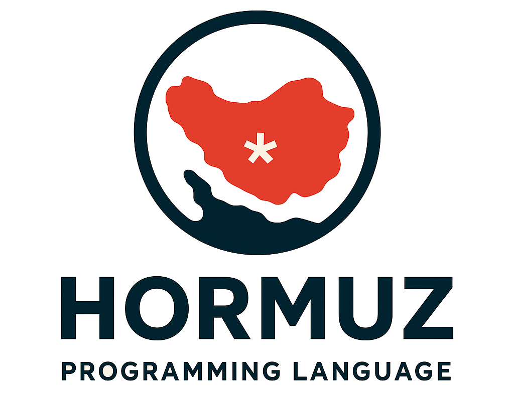

<div dir="rtl">


# زبان برنامه‌نویسی هرمز (Hormuz Programming Language)

**هرمز** یک زبان برنامه‌نویسی ساده، ایرانی و فارسی‌محور است که به صورت مستقیم از روی دستورات فارسی به زبان C ترجمه (Transpile) می‌شود.  

هدف این پروژه، آموزش مفاهیم پایه‌ای برنامه‌نویسی به فارسی‌زبانان (به‌ویژه دانش‌آموزان و علاقه‌مندان تازه‌کار) است.

---

## ویژگی‌ها

- نگارش دستورات به زبان فارسی  
- جایگزینی کلمات کلیدی فارسی به معادل‌های C  
- اجرای مستقیم کد تولیدشده توسط GCC یا Clang  
- ساده، سریع و بدون نیاز به تحلیل‌گر نحوی (Parser) پیچیده  

---

## نمونه کد

### ورودی (کد فارسی – فایل `hello.hormuz`):

```c
عدد اصلی() {
    چاپ("سلام دنیا!\n");
    بازگردان 0;
}
````

### خروجی (کد C تولید شده):

```c
int main() {
    printf("سلام دنیا!\n");
    return 0;
}
```

---

## نصب و اجرا

### ساخت کامپایلر (Transpiler)

```bash
gcc -std=c11 -O2 -o hormuz hormuz.c
```

### استفاده

```bash
./hormuz -i hello.hormuz -o hello.c
gcc hello.c -o hello
./hello
```

---

## نقشه راه

* [x] پشتیبانی از کلمات کلیدی پایه (اگر، وگرنه، حلقه، بازگردان و …)
* [ ] افزودن پیش‌پردازنده برای افزودن `#include`های لازم (مثلاً `stdio.h`)
* [ ] بهبود قالب‌بندی کد خروجی
* [ ] گسترش نگاشت کلمات کلیدی به توابع و انواع داده‌ی بیشتر

---

## لایسنس

MIT License

</div>
